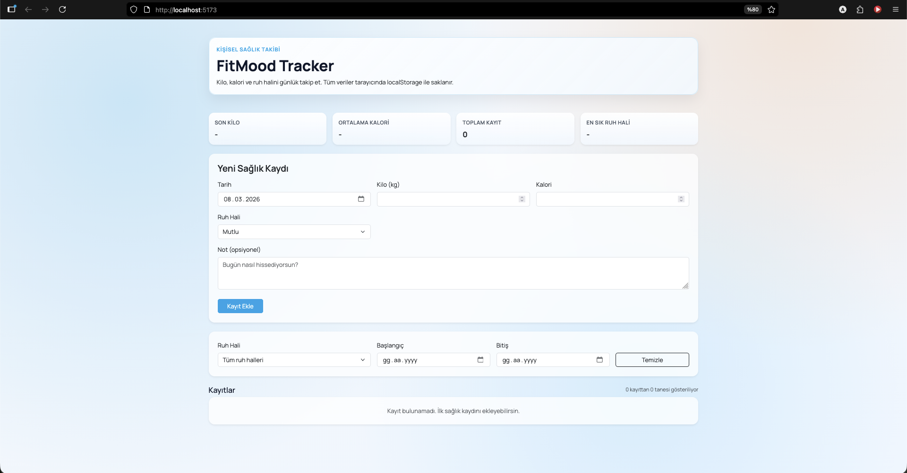

# FitMood Tracker

FitMood Tracker, React + Vite ile geliştirilmiş kişisel bir sağlık takip uygulamasıdır.
Kullanıcı günlük olarak kilo, kalori, ruh hali ve not bilgisini kaydedebilir.
Tüm veriler tarayıcıda `localStorage` üzerinde saklanır (backend yok).

## Ekran Görüntüsü



## Özellikler

- Yeni sağlık kaydı ekleme
- Tüm kayıtları listeleme
- Kayıt güncelleme
- Kayıt silme
- Ruh hali ve tarih aralığına göre filtreleme
- Özet kartlar:
  - Son kilo
  - Ortalama kalori
  - Toplam kayıt
  - En sık ruh hali
- Responsive (mobil + masaüstü) arayüz

## Kullanılan Teknolojiler

- React 18
- Vite
- TypeScript
- Bootstrap 5
- localStorage

## Projeyi Çalıştırma

Gereksinimler:

- Node.js 18+
- npm

Komutlar:

```bash
npm install
npm run dev
```

Üretim build'i almak için:

```bash
npm run build
npm run preview
```

## Proje Yapısı

```text
src/
  components/
    FilterBar.tsx
    HealthForm.tsx
    RecordsTable.tsx
    SummaryCards.tsx
  pages/
    DashboardPage.tsx
  interfaces/
    HealthRecord.ts
  constants/
    moods.ts
  utils/
    storage.ts
  App.tsx
  main.tsx
  index.css
```

## Veri Modeli

Her kayıt şu alanları içerir:

- `id: string`
- `date: string` (YYYY-MM-DD)
- `weight: number`
- `calories: number`
- `mood: "Happy" | "Calm" | "Motivated" | "Tired" | "Stressed" | "Sad"`
- `note: string`

Not: Uygulama arayüzü Türkçe olsa da ruh hali değerleri veri tutarlılığı için iç yapıda İngilizce saklanır.

## Form Doğrulama

`HealthForm` içinde istemci tarafı doğrulamalar vardır:

- Tarih zorunlu
- Kilo pozitif olmalı
- Kalori 0 veya daha büyük olmalı
- Ruh hali geçerli seçeneklerden biri olmalı
- Not en fazla 300 karakter olmalı

## localStorage Entegrasyonu

- Anahtar: `fitmood_records_v1`
- Uygulama açılışında kayıtlar `loadRecords()` ile okunur
- `records` state'i değiştikçe `saveRecords()` ile otomatik kaydedilir
- Hatalı/veri formatı bozuk kayıtlar filtrelenir

## Filtreleme Mantığı

Kayıtlar şu kriterlerle filtrelenir:

- Ruh hali (`All` seçiliyse hepsi)
- Başlangıç tarihi (`fromDate`)
- Bitiş tarihi (`toDate`)

Sonuç listesi tarihe göre azalan şekilde (en yeni üstte) sıralanır.

## Özet Kart Mantığı

- Son kilo: En yeni tarihli kaydın kilo değeri
- Ortalama kalori: Tüm kayıtların kalori ortalaması (yuvarlanmış)
- Toplam kayıt: Kayıt sayısı
- En sık ruh hali: Frekansı en yüksek ruh hali
